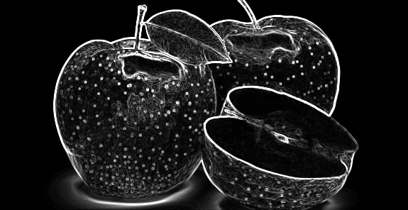

# ⚡ GlitchCore: High-Performance Wasm Image Processor


An experimental image processing engine that runs **C++ logic directly in the browser** via WebAssembly (Wasm). This project demonstrates how to perform computationally expensive CPU-bound algorithms (like sorting pixels, convolution matrices, or mathematical distortion) in real-time within a React application, bypassing the GPU limitations for logic-heavy operations.

## 📸 Visual Effects Showcase

The engine processes raw pixel data in the C++ Heap and renders it to an HTML5 Canvas using a zero-copy shared memory approach.

|                 Source Input                 |         Sobel (Edge Detection)          |            Ripple (Sine Distortion)            |
| :------------------------------------------: | :-------------------------------------: | :--------------------------------------------: |
|  |  |       |
|           _Standard loaded image_            | _3x3 Convolution Matrix running on CPU_ | _Trigonometric displacement based on distance_ |

## 🚀 Key Features

- **Hybrid Architecture:** React (TypeScript) handles the UI, while C++ handles the heavy pixel manipulation.
- **Zero-Copy Rendering:** Implements direct memory access between JavaScript's `Uint8ClampedArray` and the C++ Heap (`HEAPU8`) to minimize serialization overhead.
- **CPU-Bound Effects:** Implements algorithms that are typically difficult or inefficient to program in standard WebGL shaders:
  - **Pixel Sorting (Melting):** Sorting vertical pixel strips by luminance.
  - **Sobel Edge Detection:** Matrix convolutions for edge highlighting.
  - **Interactive Lens:** Mathematical "bubble" masking calculated per pixel in real-time.
- **11 Unique Shaders:** Including Swirl, Jitter, Mosaic, Solarize, RGB Noise, and Scanline.

## 🛠️ Tech Stack

- **Core Logic:** C++17 (Standard Template Library)
- **Compilation:** Emscripten (emsdk) → WebAssembly (.wasm)
- **Frontend:** React, TypeScript, Vite
- **Design Pattern:** Strategy Pattern (C++) & Custom Hooks (React)

## 🏗️ Architecture Overview

Unlike WebGL/Three.js which relies on the GPU for parallel rendering, this engine leverages **WebAssembly for sequential and complex logic tasks**.

1.  **Memory Allocation:** The image data is loaded directly into the C++ Heap.
2.  **Processing:** On mouse movement, the C++ engine calculates the effect only within the "Lens" radius (optimization) or on the full frame.
3.  **Rendering:** React reads the modified memory pointer (`getDisplayPointer`) directly and paints it to the canvas using `putImageData`.

## 📦 Installation & Setup

1.  **Clone the repository**

    ```bash
    git clone [https://github.com/Yucaloid/wasm-image-processing-engine.git](https://github.com/Yucaloid/wasm-image-processing-engine.git)
    cd wasm-image-processing-engine
    ```

2.  **Install dependencies**

    ```bash
    npm install
    ```

3.  **Run Development Server**

    ```bash
    npm run dev
    ```

    _Open your browser at `http://localhost:5173` (or the port shown in terminal)._

> **Note:** The `.wasm` binary is pre-compiled in the `public/` folder. To recompile the C++ core yourself, you need the [Emscripten SDK](https://emscripten.org/docs/getting_started/downloads.html) installed.

## 📜 License

MIT License.
